# Week2 時間順序審查（Day 8–14）

> game-tester 專用。權威班表：`Ch1_Trust/game/js/systems.js` → `DEMO_DAY_CALENDAR`；架構：`Ch1_Trust/Ch1_week2_architecture.md`。

## 審查結論（2026-07-03）

**PASS** — 故事天、文案星期、主線日序、跳日入口與班表時段一致；無 P0／P1。

| 檢項 | 結果 |
|------|------|
| 主線 16 場 `day` 單調遞增（同日可連續） | ✓ |
| 跨日僅 +1（無跳兩天以上） | ✓ |
| 文案明示星期 ↔ `DEMO_DAY_CALENDAR.label` | ✓（6 場） |
| 上班日無「白天無故在家」 | ✓ |
| `DAY_JUMP_TARGETS` 8–14 與場景 `day` 對齊 | ✓ |

自動化：`node tools/validate-week2-chronology.js`

---

## 故事天 ↔ 星期 ↔ 主場景

Day 1＝週三傍晚相遇；**Day 8 起為相遇後第二個曆週**。

| 故事天 | 星期 | 班表 | 主線場景（依播放順序） | 文案星期 |
|--------|------|------|------------------------|----------|
| 8 | 週三 | 上班 | `week2_intro`（晨）→ `week2_neighbor`／`after`（傍晚） | （過渡，不寫星期） |
| 9 | 週四 | 上班 | `week2_calendar`（夜） | 週四晚上 |
| 10 | 週五 | 上班 | `week2_friday_morning` → `elevator_*`（晨／通勤） | 週五早晨 |
| 11 | 週六 | 放假 | `week2_camera_roll`（午後） | 週六午後 |
| 12 | 週日 | 放假 | `week2_sock_snatch`（午後） | 週日 |
| 13 | 週一 | 上班 | `week2_park_*`（傍晚）→ `week2_dryer_truce`（夜） | 週一傍晚 |
| 14 | 週二 | 上班 | `week2_no_bite`／`after`（傍晚→夜）→ `week2_epilogue` | 週二傍晚 |

**時段弧（玩家體感）：** D8 晨出門→傍晚鄰居；D9 夜行事曆→隔日 D10 晨電梯；D10 結束→週末 D11–12 在家；D12→D13 傍晚公園＋夜洗澡；D13 睡→D14 傍晚防咬→第二週結語。

---

## 主線日序圖

```mermaid
flowchart LR
  subgraph D8["Day 8 週三"]
    a[intro 晨] --> b[neighbor 傍晚] --> c[after]
  end
  subgraph D9["Day 9 週四"]
    c --> d[calendar 夜]
  end
  subgraph D10["Day 10 週五"]
    d --> e[friday_morning] --> f[elevator] --> g[after]
  end
  subgraph D11["Day 11 週六"]
    g --> h[camera_roll]
  end
  subgraph D12["Day 12 週日"]
    h --> i[sock_snatch]
  end
  subgraph D13["Day 13 週一"]
    i --> j[park_go] --> k[park_tree] --> l[park_play?] --> m[dryer 夜]
  end
  subgraph D14["Day 14 週二"]
    m --> n[no_bite] --> o[after] --> p[epilogue]
  end
```

`park_play` 需 D10 `socialTier === 'close'`；否則 `park_tree` 直達 `dryer_truce`。

---

## 跳日入口（開發選單）

| 跳日 | 入口場景 | 場景 `day` |
|------|----------|------------|
| 8 | `week2_intro` | 8 |
| 9 | `week2_calendar` | 9 |
| 10 | `week2_friday_morning` | 10 |
| 11 | `week2_camera_roll` | 11 |
| 12 | `week2_sock_snatch` | 12 |
| 13 | `week2_park_go` | 13 |
| 14 | `week2_no_bite` | 14 |
| week2_epilogue | `week2_epilogue` | 14 |

Day 9 **僅** `week2_calendar` 一場——設計上為「行事曆夜間」單場，非漏場。

---

## P2 備註（不阻擋 PASS）

| 項目 | 說明 | 負責 |
|------|------|------|
| 架構表「敘事日 W2 Mon…」欄 | 與曆法星期不同義，易誤讀；以 `DEMO_DAY_CALENDAR` 為準 | story-narrative（文件） |
| `week2_friday_morning` 命名 | id 含 friday，對應 Day 10＝週五，與文案一致 | 可保留 |
| `validate-work-schedule.js` | 現僅 spot-check Day 2–7；Week2 改由本檔＋`validate-week2-chronology.js` | game-tester |

---

## 手動複驗（建議每改 Week2 劇情後）

1. `node tools/validate-week2-chronology.js`
2. 跳日 Day 8→14 各一輪，核對 HUD「第 N 天」與字幕星期
3. 主線不跳關：D8 選「出門上班」→ 一路至 `week2_epilogue`，確認無「昨天週五今天還週五」類錯覺

## 問題分級（時間序）

| 級別 | 範例 |
|------|------|
| **P0** | 主線 `day` 倒退、`next` 斷在錯誤日 |
| **P1** | 文案「週六」但 `day` 對應週日；上班日中午無故客廳場景 |
| **P2** | 過渡場景未寫星期（可接受）；架構文件欄位易混淆 |
